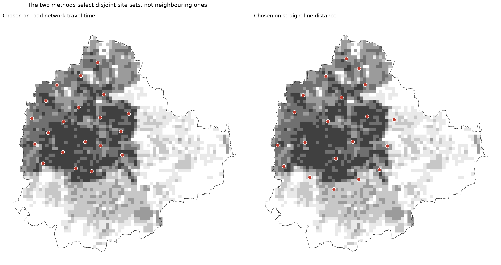
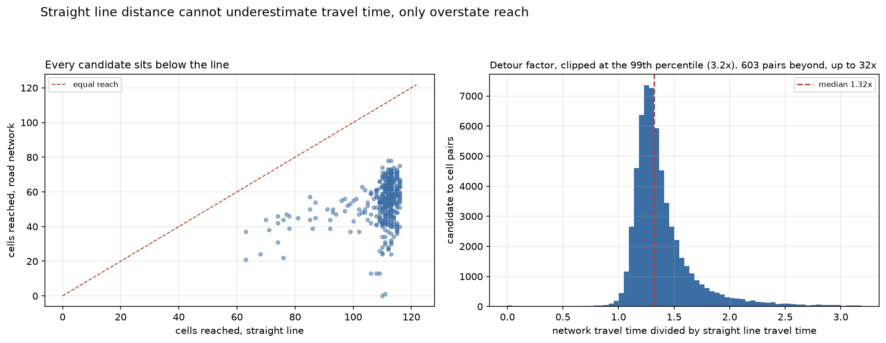
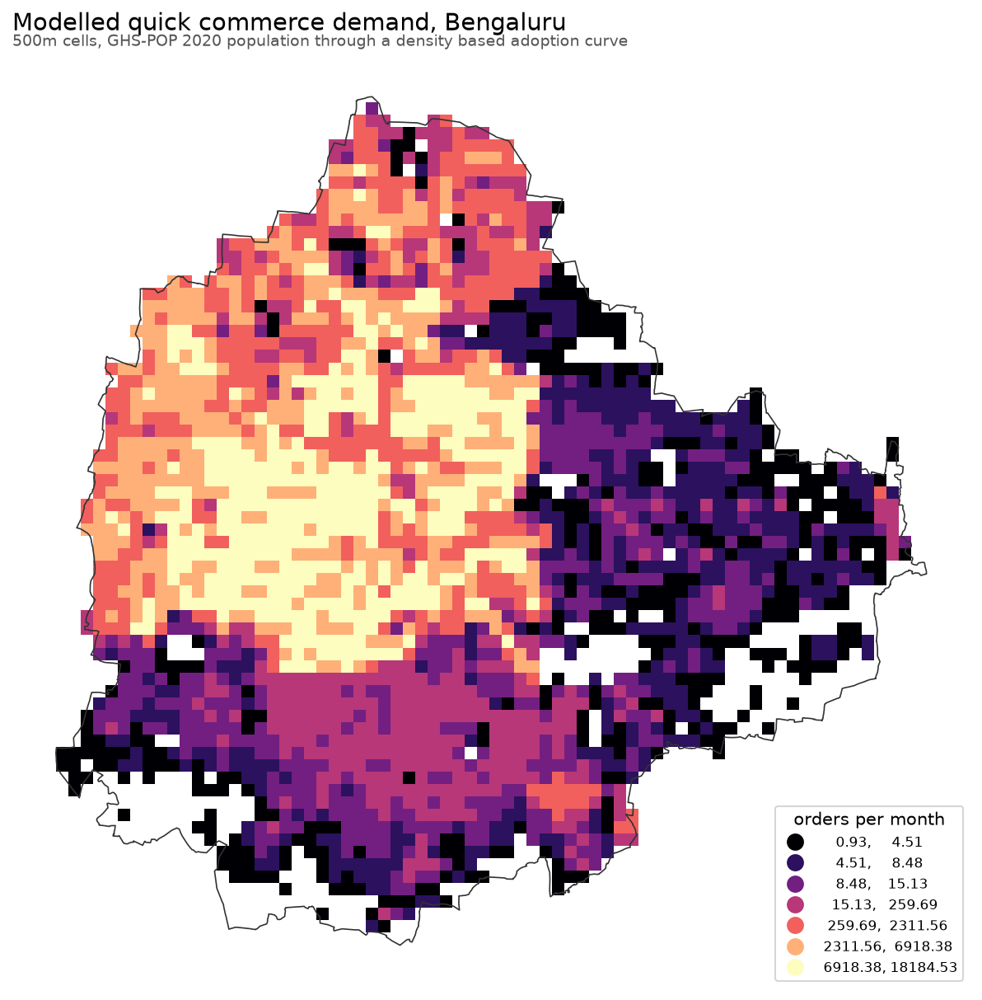
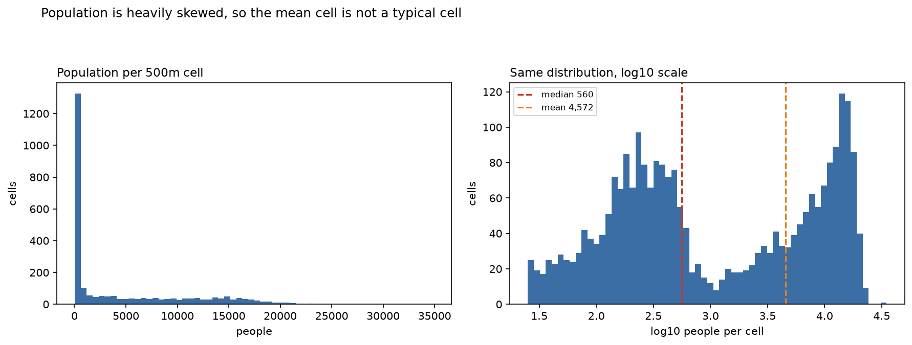
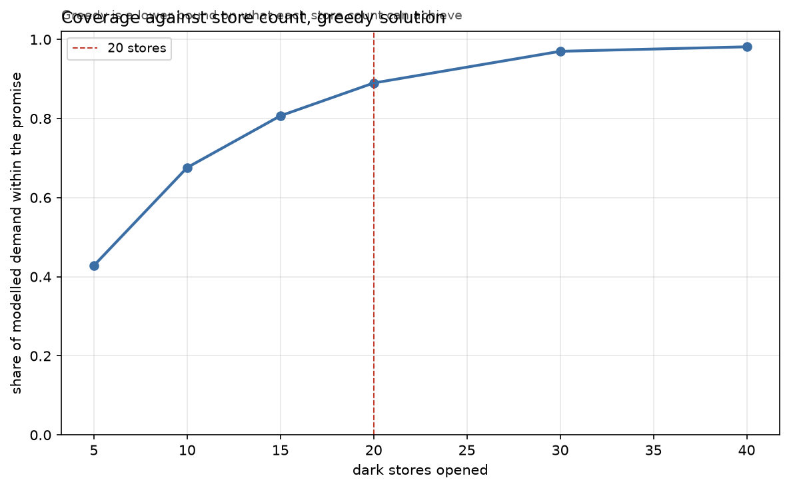

# Dark Store Site Selection, Bengaluru

Where should a quick commerce operator put its next 20 dark stores so that the
most demand sits inside a 10 minute delivery promise.

I built this to do one thing properly that almost every "where should we put our
stores" analysis does badly: **measure distance along the actual road network
rather than in a straight line.** That is not a detail. On this city, straight
line distance makes each candidate site look like it reaches **2.03 times** as
many neighbourhoods as it really does, and a store network chosen that way
covers **63% of demand where the network optimum covers 94%**.

Everything below comes from running the pipeline. No figure in this README was
typed in by hand.



## The headline result

I solved the same problem twice, changing only how travel time is measured.

| | chosen on road network | chosen on straight line |
|---|---:|---:|
| Coverage it claims | 93.69% | 98.81% |
| Coverage it actually delivers | 93.69% | 63.18% |
| Overstatement | none | 35.6 points |
| Sites in common between the two | **0 of 20** | **0 of 20** |

The 63.18% is the **best** straight line result, not a typical one. A single
solve returns 58.65%, and resampling the tie breaks (below) puts the range at
58.65% to 63.18%. I quote the best case everywhere in this README so the
comparison is as generous to the straight line method as the evidence allows.

The straight line method does not just report an inflated number. It picks a
**completely different and materially worse set of sites**, then reports a
number that looks better than the good answer. That is the worst possible
failure mode for a decision tool: confidently wrong, and wrong in the direction
that makes it look right.

In the units the business cares about, choosing sites on straight line distance
costs **1.69 million orders per month** of coverage at this store count, taking
the best case straight line solution. Taking the one a single solve actually
returned, it costs 1.94 million.

## I checked whether that result was real before believing it

The maximal covering problem has many alternate optima. When 400 candidates can
between them reach 98% of a city, a great many different sets of 20 hit the same
objective value, and the solver returns whichever it reaches first. So "0 of 20
sites in common" could have been an artefact of an arbitrary tie break rather
than a property of the method, and the 63% could have been one unlucky draw.

`scripts/check_alternate_optima.py` resamples the straight line optimum 20 times
by perturbing the demand weights by up to 0.1%, which breaks ties differently
without meaningfully changing the problem, and scores every resulting site set
against network truth.

| | |
|---|---:|
| Network optimum | 93.69% |
| Best straight line solution, scored on the network | 63.18% |
| Worst straight line solution | 58.65% |
| Trials reaching the network optimum | 0 of 20 |
| Distinct sites used across all 20 trials | 21 |
| Sites common to every trial | 19 |

Two things came out of this. The straight line solution is **stable**, not
arbitrary: 19 of its 20 sites are identical across every trial. And **even its
best case falls 30.5 points short** of the network optimum. The finding survived
the check, so I am reporting it as a finding rather than a coincidence.

## Why straight line distance fails here, specifically



The left panel is the whole argument in one picture. Every candidate sits below
the equal reach line, and that is not an empirical accident: a road path can
never be shorter than the straight line between the same two points, so straight
line distance **can only ever overstate reach, never understate it**. The
pipeline confirms it holds with no exceptions: of 1,038,800 candidate to cell
pairs, 22,180 disagree, and **all 22,180 are cases where the straight line says
covered and the road network says not**. Zero go the other way.

The median detour factor is **1.32x**, meaning a typical trip takes 32% longer by
road than a straight line suggests. The tail matters more than the median
though: a small number of pairs run to 30x, and those are the cells that sit
close in a straight line but far by road, across a lake, a railway line or a
limited access corridor. Bengaluru has plenty of all three, which is why the
error is not a uniform fudge factor that a corrected constant speed could absorb.

## The demand surface



| | |
|---|---:|
| City boundary (BBMP, from OSM) | 717.2 sq km |
| Analysis grid | 2,867 cells at 500m |
| Population, GHS-POP 2020 | 11,874,821 |
| Households at 4.3 per household | 2,761,018 |
| Population weighted adoption rate | 0.251 |
| Modelled orders per month | 5,547,356 |

The chain is short and every link is a proxy:

    population -> households -> adopting households -> orders per month

**The adoption rate is the weakest input in this project and I want to be
explicit about it.** Quick commerce adoption concentrates in dense, younger,
higher income neighbourhoods, and there is no public dataset of it at grid
level. I use population density as the only available proxy, with four
judgemental rate bands in `config/config.yaml`. They are not sourced. They are
the reason the sensitivity analysis exists.

As an outside check, 5.5 million orders per month for Bengaluru is the right
order of magnitude against the disclosed national order volumes of the listed
players, which is reassuring about the level but says nothing about whether the
rate is distributed correctly across the city. Distribution is what site
selection actually depends on.



Population across cells is heavily skewed: the median populated cell holds 450
people and the mean holds 4,173. I plotted this rather than quoting a single
number because the skew is the thing that makes a covering problem interesting.
If demand were uniform, site selection would be a packing exercise.

## Method

### Population, without resampling it

GHS-POP values are residential population **counts** per 100m cell, not a
density. Two consequences drive the implementation:

- Aggregating to the analysis grid means **summing** the pixels inside each
  cell. Averaging or bilinear sampling would be wrong.
- The raster is in Mollweide and the analysis is in UTM 43N, but I **never
  reproject the raster**. Reprojecting a count raster resamples it, resampling
  redistributes counts between cells, and the total stops being conserved.
  Instead I transform the pixel **centres** as points and join them to the grid.
  Every pixel lands in exactly one cell, and nothing is invented or lost.

I also switched population source mid build, for reasons I tested rather than
assumed. I started on WorldPop, whose India raster is 466 MB. Its host advertises
`Accept-Ranges: bytes` but ignores a `Range` header and returns the whole file,
so a windowed remote read is impossible, and it served at roughly 85 KB/s against
the JRC host's 550 KB/s. GHS-POP is distributed as 1000km tiles, so one 47 MB
tile covers the city. The tile index is computed from a coordinate in
`src/tiles.py`, so pointing this at another city is a config change.

### The road network

| | |
|---|---:|
| Nodes | 155,545 |
| Edges (directed) | 393,912 |
| Centreline length | 13,003.6 km |
| Effective rider speed | 18 km/h |

OSMnx returns a MultiDiGraph, so a two way street contributes two edges. Summing
edge lengths gives 24,251.1 km, which is roughly double the real centreline
length. Reporting that as "road length" would overstate the network by a factor
of two, so both numbers are computed and the undirected one is the one quoted.
At 13,004 km it lines up with BBMP's own published road length.

I use a single effective speed rather than OSM `maxspeed` tags. Those tags are
free flow legal limits, most Bengaluru links do not carry one, and a two wheeler
in city traffic travels at neither. One stated, sensitivity tested number is more
honest than a per link value that looks precise and is not.

### The travel time matrix, and why it is cheap

The naive formulation is all pairs shortest path between 400 candidates and
2,597 cells over a 155,545 node network. But anything beyond the delivery promise
is irrelevant to a covering problem, so I run **one cutoff bounded Dijkstra per
candidate** instead, which never expands the far side of the city.

| | |
|---|---:|
| Matrix shape | 400 x 2,597 |
| Build time | 5.2 s |
| Node expansions | 4,060,456 |
| Expansions an uncapped run would need | 62,218,000 |
| Work avoided | **93.5%** |

Candidate centroids snap to the network at a median of 48m (p95 167m, max 472m).
Demand cells snap at a median of 40m, but p95 is 246m and the **worst is
1,643m**. That last cell is being modelled as if it sat on a road 1.6 km from
where it actually is. It is one cell out of 2,597 and it does not move the
result, but a snap distance is a modelling error and I would rather report the
tail than quote the median and move on.

### The optimisation

The Maximal Covering Location Problem, written out so it can be checked:

    sets
        I    demand cells, weight w_i
        J    candidate sites
        N_i  subset of J reaching cell i within the threshold

    variables
        x_j in {0,1}   open a store at j
        y_i in {0,1}   cell i is covered

    maximise    sum_i w_i * y_i
    subject to  y_i <= sum_{j in N_i} x_j    for all i
                sum_j x_j = p

Solved with CBC through PuLP. On this instance it **proves optimality in 1.1
seconds**, so the reported optimum is a proven one and not an incumbent that hit
a time limit. The code reports which of those two it got, because presenting an
incumbent as an optimum is exactly the kind of quiet overclaim this project is
trying to avoid.

I also implemented a greedy heuristic, not as a fallback but as a baseline:

| | coverage | time |
|---|---:|---:|
| Exact (CBC) | 93.69% | 1.1 s |
| Greedy | 88.98% | 0.02 s |

Greedy leaves **5.03%** of the achievable demand on the table. That number is why
the exact solve is worth running, and `tests/test_optimise.py` pins a constructed
instance where greedy provably reaches 9 against the optimum's 12, so the gap is
a property of the algorithm rather than an accident of this data.

### Candidate sites

Candidates come from OSM `landuse` polygons tagged retail, commercial or
industrial: 3,491 parcels, thinned to 888 by a 400m minimum separation, then
capped at the 400 with the most demand within reach. Without the separation
constraint the set piles up along a few commercial strips and the optimiser
spends its budget distinguishing between sites 30m apart.

This filters for physical plausibility only. It says nothing about whether a
lease is available, what the rent is, whether the landlord will take a warehouse
tenant, whether there is three phase power and backup, or whether loading a fleet
of two wheelers at 7am survives contact with the neighbours. **The optimiser
answers "where is best given coverage", not "where can you actually open".**

## Coverage against store count



| stores | coverage |
|---:|---:|
| 5 | 42.82% |
| 10 | 67.59% |
| 15 | 80.69% |
| 20 | 88.98% |
| 30 | 96.99% |
| 40 | 98.13% |

Diminishing returns set in hard after about 30 stores. These are greedy
solutions, so each is a lower bound on what that store count can achieve.

## What this project does not establish

- **There is no ground truth.** No held out test set says the site selection was
  correct. The deliverable is a decision framework with its sensitivities
  exposed, not a validated optimum.
- **The adoption curve is judgemental.** Its four rate bands are the least
  defensible numbers here, and site selection depends on them.
- **The population raster is the 2020 epoch.** Bengaluru has grown since, so
  absolute figures are understated by an unknown margin. I did not correct this
  with an invented growth factor.
- **Travel time is rider travel time only.** It excludes picking, packing,
  handover and waiting at the door, which in practice consume a large share of a
  10 minute promise. A 10 minute travel budget is not a 10 minute delivery.
- **One speed for the whole city, all day.** No congestion profile, no peak and
  off peak, no difference between an arterial and a lane.
- **Coverage is not the only objective.** Real siting trades coverage against
  rent, labour, cannibalisation between stores and inventory economics. None of
  those are modelled.

## Running it

```bash
make setup     # virtualenv and dependencies
make fetch     # download the 47 MB GHS-POP tile into data/raw/
make phase1    # boundary, grid, population, demand surface
make phase2    # candidates, travel time matrices, straight line comparison
make phase3    # the optimisation and the straight line penalty
make figures   # every figure in this README
make test      # 18 tests
```

Raw rasters, the cached road network and the travel time matrices stay out of
version control. `scripts/fetch_data.py` reproduces the only external download.

## Repository layout

```
config/config.yaml     every assumption, cited. No magic numbers in code.
src/tiles.py           GHSL tile index arithmetic
src/population.py      raster to grid, without resampling counts
src/demand.py          the demand chain and its sensitivity variants
src/network.py         road network, cutoff Dijkstra matrix, haversine matrix
src/candidates.py      OSM land use parcels, thinning, capping
src/optimise.py        MCLP exact and greedy, site stability
src/viz.py             figures
scripts/               one runner per phase, plus the robustness check
reports/               summary JSON per phase, figures
tests/                 18 tests
```

## Status

Phases 1 to 3 and the robustness check are complete and every number above comes
from a run. Phase 4, the full sensitivity sweep across rider speed, delivery
threshold, store count and grid resolution, plus the decision memo, is still to
do. See `PROGRESS.md`.

## Data sources

- **Population**: JRC Global Human Settlement Layer, GHS-POP R2023A, 100m,
  epoch 2020, tile R8_C26. Schiavina, Freire, Carioli, MacManus (2023),
  European Commission Joint Research Centre.
  https://ghsl.jrc.ec.europa.eu/ghs_pop2023.php
- **Road network and land use**: OpenStreetMap, via OSMnx, pulled 2026-08-28.
  Copyright OpenStreetMap contributors, ODbL.
- **City boundary**: OSM Nominatim, "Bengaluru, Karnataka, India".
- **Household size**: Census of India 2011, House Listing and Housing Census,
  Karnataka urban average.

## License

MIT. See `LICENSE`.
